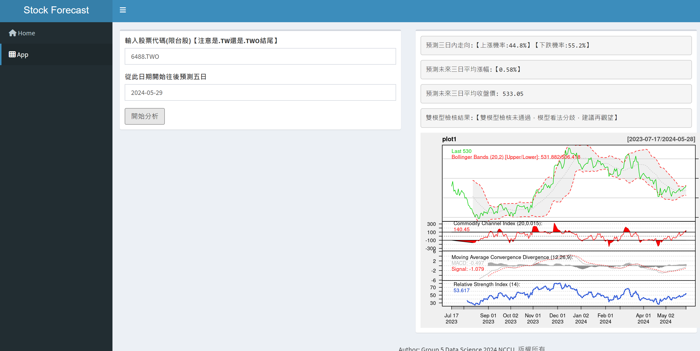

# [Group5] Multi-stock Price Prediction: Forecasting the Direction and Magnitude of Stock Prices for the Next Three Days
# 我們的產品設計

我們設計了一款產品，其資料來源收集自Yahoo! 股市，包含兩種預測模型：

1. **第一種模型**：預測未來三日或五日的收盤價。
2. **第二種模型**：預測未來三日或五日的上漲機率。

這些模型旨在幫助投資者，在股市波動時提供一個預測工具，以便更好地進行股票買賣決策。

## Contributors
|組員|系級|學號|工作分配|
|-|-|-|-|
|陳宥任|資科碩一|112753218|建立模型(Random Forest、 xgboost)，Github，海報製作| 
|謝皓雲|資科碩一|112753120|資料收集，整理數據，統整模型，建立股票預測架構，shinyapp建立，海報製作|
|郭承諺|資科四|109703032|建立模型(Random Forest、 xgboost)，海報製作|
|吳秉叡|社會四|109204039|資料收集，建立模型(Random Forest、 xgboost)，海報製作|
|鄭丞皓|資科三|110703067|建立模型(Random Forest、 xgboost)，海報製作|
|陳聰堯|阿文四|108502006|資料收集，整理數據，建立模型(Random Forest、 xgboost)，海報製作|
## Quick start
!! We do not recommend you to run the R file directly, since the memory requirement of it is really high.!! 
The code for training the model has been uploaded to GitHub. It is recommended to download it and run it in R Studio. 
If you have any technical problem, feel free to contact us.

### docs
* Presentation:  
* Shinyapps: [https://anselcheng.shinyapps.io/HousePrice/](https://112753120nccu.shinyapps.io/Stock_Prediction/)

### data
* Input
  * Source : 
     * stock_train_data.csv
     * 資料收集來自 yahoo!股市；使用R語言，將資料爬下來。
     * 資料網站連結 : https://tw.finance.yahoo.com/

  * Format:  csv檔案
  * Size 
     * 數量 : 54989筆資料 
     * 特徵欄位 : Rsi , macd , signal , cci , pctB , close , up , avg5 , up5 , avg3 , up3 , macd_way  
### 股票市場Feature介紹

* **Rsi**：用於衡量股票價格的變動速度和變動幅度，範圍在0到100之間。當RSI超過70時，表示股票可能處於超買狀態，價格可能回落；當RSI低於30時，表示股票可能處於超賣狀態，價格可能回升。
* **macd**：是一種技術分析指標，當MACD線從上向下穿過訊號線時，這是一個賣出信號；當MACD線從下向上穿過訊號線時，這是一個買入信號。
* **signal**：與macd線一起使用，提供買賣信號。
* **cci**：CCI是一種震盪指標，用於衡量價格相對於其平均價位的偏離程度。CCI高於+100表示價格超買，低於-100表示價格超賣。
* **pctB**：表示價格相對於布林帶的位置。pctB值在0和1之間。當pctB值高於1時，表示價格超過上布林帶，當pctB值低於0時，表示價格低於下布林帶。
* **close**：代表股票在交易日結束時的收盤價格。
* **up**：代表隔天股票價格的上漲。
* **avg5**：五日移動平均線，表示過去五個交易日的平均收盤價。
* **up5**：未來五日漲跌幅，1表示上漲，0表示下降。
* **avg3**：三日移動平均線，表示過去三個交易日的平均收盤價。
* **up3**：未來三日漲跌幅，1表示上漲，0表示下降。
* **macd_way**：up表示上漲，down表示下降。

 
### code
* Analysis steps
  *  set seed
  *  Feature Selection
  *  grid search
  *  Data Preprocessing
  *  model build (randomforest, xgboost, linear regression, logistic regression)
  *  choose the model
  *  prediction
  *  compare F1_score, R_squared, accuarcy

 
* Which method or package do you use?
  * Random Forest(library(randomForest))
  * hyper_parameter_select(library(glmnet))
  * confusion matrix(library(caret))
  * Auc(library(pROC))
  * F1_score(library(MLmetrices))
  * library(smotefamily)
  * Feature Selection(library(dplyr)) 
 
* How do your perform evaluation?
  *  F1_score , R_squared 

### results
* What is your performance?
  * Two types of models for prediction:
  * predicting the closing price for the next three or five days, evaluated using R-squared.
  * Predicting the probability of an increase in the next three or five days, evaluated using F1_score.
 
    

 

## References
* Packages you use
  * xgboost
  * ggbiplot
  * pROC
  * caret
  * ggplot2
  * glmnet
  * randomForest
  * MLmetrics
  * shiny
  * ggbiplot
  * dplyr
  * smotefamily

